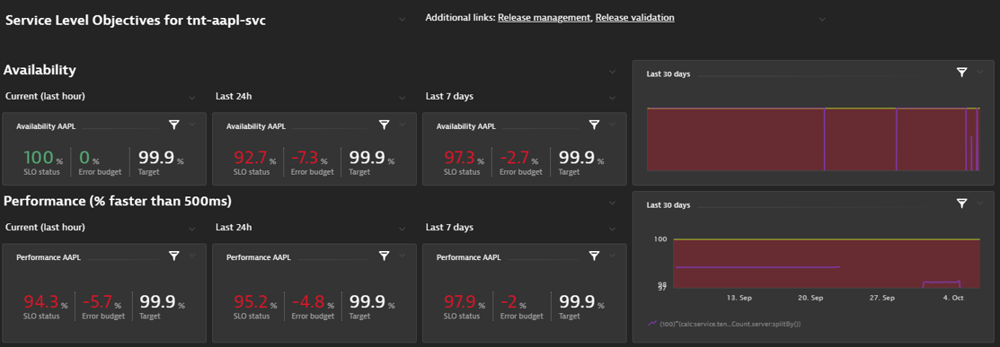
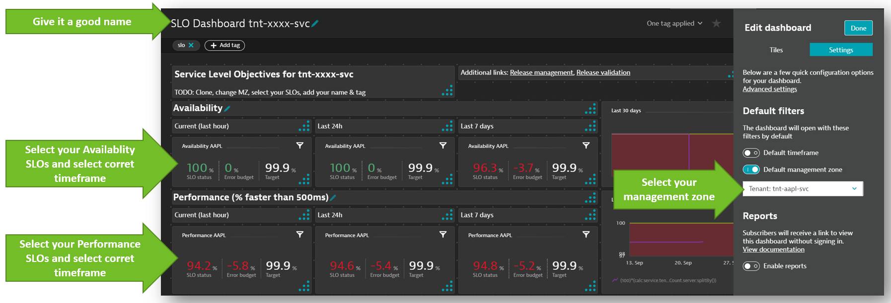
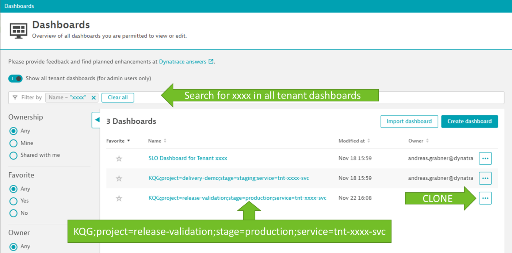
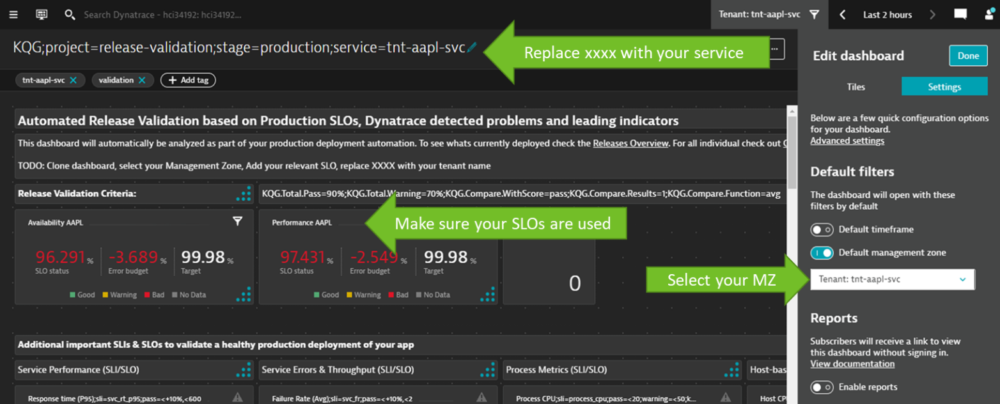

# Dynatrace Cloud Automation Workshop - Instructions for Attendees

Here is the TOC for this workshop

Overview:
1. Our lab environment
2. Our demo application

Followed by 3 labs
1. Lab 1 - Production Reliability
2. Lab 2 - Release Validation
3. Lab 3 - Delivery Pipelines

## Access to the lab environment

### Login Credentials

Your instructor will give you login credentials to
* A Dynatrace Environment
* A Cloud Automation Environment
* A Bastion Host

### Install Keptn CLI locally

While the Bastion host can be ued to trigger keptn CLI commands you can also install the Keptn CLI yourself.
Please ask your instructor which version to install so it matches the cloud automation instance. Or simple download it via the download link in the Cloud Automation UI (top right menu)
Here the sample on how to install e.g: 0.9.2 CLI on your Linux:
```sh
curl -sL https://get.keptn.sh | KEPTN_VERSION=0.9.2 sudo -E bash
```

To connect to local Keptn CLI with your Cloud Automation instance copy the `keptn auth` command from the Cloud Automation UI (top right)

To validate you are connected you can run 
```
keptn status
``` 

## Our sample app today

The workshop will use a very simple Node.js based sample application. Details can be found here https://github.com/grabnerandi/simplenodeservice.

### Your instance of the app

Every attendee has their own pipeline to deploy the sample app across staging and production. To differentiate our instances every attendee picked a `TenantID` from the Excel list, e.g: aapl, goog, sbux, ...
If your assigned TenantID is aapl then the service instance name is `tnt-aapl-svc`

### 4 different versions of the app available
The sample application used comes with 4 different container versions that are all uploaded to dockerhub:

| Image | Description |
| ------ | ------------- |
| grabnerandi/simplenodeservice:1.0.1 | Version 1, green background, no problems |
| grabnerandi/simplenodeservice:2.0.1 | Version 2, yellow background, high failure rate |
| grabnerandi/simplenodeservice:3.0.1 | Version 3, no problems |
| grabnerandi/simplenodeservice:4.0.1 | Version 4, only problems in production |


## Lab 1 - Production Reliability

The goal of this hands-on is to create 2 SLOs (Service Level Objectives) in Dynatrace
1. Availability SLO: based on Synthetic Monitoring
2. Performance SLO: % of requests faster than 500ms

Once we have those 2 SLOs we create an SLO dashboard we can use to always judge the reliability of our service as measured by our SLOs. 


### Step 1 - Create Availability SLO

As shown by the instructor simply walk through the *Add new SLO* wizard in Dynatrace. Here are the input values for your reference and for copy/pasting if those values are not pre-filled in the UI:

**Replace xxxx with your tenantID**

| Field | Value |
| ------ | ------------- |
| Metrics Expression | `builtin:synthetic.browser.availability.location.total:splitBy()`  |
| Name of SLO | `Availability of xxxx` |
| Description | `% of time xxxx service is available based on synthetic test` | 
| Entity Selector | `type("SYNTHETIC_TEST"),tag("tnt-xxxx-svc"),tag("production")` |
| Timeframe | `-1w` |

### Step 2 - Create Performance SLO

As shown by the instructor simply walk through the *Add new SLO* wizard in Dynatrace. Here are the input values for your reference and for copy/pasting if those values are not pre-filled in the UI:

**Replace xxxx with your tenantID**

| Field | Value |
| ------ | ------------- |
| Metrics Expression | `(100)*(calc:service.tenant.responsetime.count.faster500ms:splitBy())/(builtin:service.requestCount.server:splitBy())`  |
| Name of SLO | `Performance SLO of xxxx` |
| Description | `% of requests handled by xxxx service faster than 500ms` | 
| Entity Selector | `type("SERVICE"),tag("[Environment]WorkshopTenant:xxxx"),tag("[Environment]DT_APPLICATION_ENVIRONMENT:production")` |
| Timeframe | `-1w` |

### Step 3 - Create SLO Dashboard

Clone the *preset* dashboard with the name `SLO Dashboard tnt-xxxx-svc`. Then modify the cloned dashboard as explained in the following screenshot!


## Lab 2 - Release Validation

The goal of this hands-on is to create a release validation dashboard including 
1. Our SLOs we created in Lab 1
2. Additional release health indicator metrics

and then have it automatically evaluated giving us an SLO score for a certain release validation timeframe:


### Step 1 - Clone dashboard

Clone the *preset* dashboard with the name `KQG;project=dynatrace;stage=production;service=tnt-xxxx-svc` as shown here:


### Step 2 - Rename dashboard and configure your SLOs

The following screenshot shows the changes you have to make. Please ensure that
1. The name of your dashboard is `KQG;project=dynatrace;stage=production;service=tnt-xxxx-svc` (replace xxxx with your tenantId)
2. Select the your Management Zone
3. Select your SLOs for your tenant



### Step 3 - Save the dashboard

That should be easy :-) -> just validate after saving that he name does not include `cloned` or `xxxx`

### Step 4 - Trigger an evaluation for your service via Keptn CLI

If you have access to the Keptn CLI (via Bastion host or installed locally) you can execute the following command (replace xxxx with your tenantId) which will:
1. Trigger an evaluation against your dashboard
2. Will evaluate the last 30 minutes
3. Will add the label `releaseA`

```
keptn trigger evaluation --project=dynatrace --stage=production --service=tnt-xxxx-svc --timeframe=30m --labels=buildId=releaseA
```

Watch the result of the evaluation in the cloud automation web ui!

**If you don't have access to the Keptn CLI** continue with *Step 6*!

### Step 5 - Trigger another evaluation 

This is just a repeat of Step 4. This time however we ue the label `releaseB`

```
keptn trigger evaluation --project=dynatrace --stage=production --service=tnt-xxxx-svc --timeframe=30m --labels=buildId=releaseB
```

Watch the result of the evaluation in the cloud automation web ui!


### Step 6 - Trigger evaluation via Keptn API

Besides using the Keptn CLI to trigger an evaluation we can also trigger it via the Keptn API. An easy way to do it is via the Swagger Web UI.
1. In the Cloud Automation UI first copy the API Token (via the menu on the top right)
2. Open the API UI (via menu in the top right)
3. Switch to the 'controlPlane` API definition
4. Authenticate the UI using the token you have in your clipboard (from point 1)
5. Scroll to the /evaluation API definition
6. Fill out the form like this -> replace xxxx with your tenant

| Field | Value |
| ------ | ------------- |
| project | `dynatrace`  |
| stage | `production` |
| service | `tnt-xxxx-svc` |
| Evaluation | 
```
{
  "labels": {
    "executedBy": "api",
    "buildId": "releaseC"
  },
  "timeframe": "30m"
}
```

Watch the result of the evaluation in the cloud automation web ui!

## Lab 3 - Delivery Pipelines

The goal of this hands-on is to shift-left the release validation dashboard approach into the delivery pipeline and use the SLO Scoring of important metrics as automated Quality Gates.


### Step 1 - Clone dashboard

Similar to Lab 2 we start by cloning a dashboard - this time the one with the name `KQG;project=delivery-demo;stage=staging;service=tnt-xxxx-svc` as shown here:


### Step 2 - Rename dashboard and configure your SLOs

The following screenshot shows the changes you have to make. Please ensure that
1. The name of your dashboard is `KQG;project=delivery-demo;stage=staging;service=tnt-xxxx-svc` (replace xxxx with your tenantId)
2. Select the your Management Zone
3. Select your SLOs for your tenant


### Step 3 - Save the dashboard

That should be easy :-) -> just validate after saving that he name does not include `cloned` or `xxxx`

### Step 4 - Trigger an deployment sequence for your service via Keptn CLI

If you have access to the Keptn CLI (via Bastion host or installed locally) you can execute the following command (replace xxxx with your tenantId) which will **trigger** a **delivery** sequence to deliver version 2.0.1 for your service

```
$ keptn trigger delivery --project=delivery-demo --service=tnt-xxxx-svc --image=grabnerandi/simplenodeservice:2.0.1
```

Watch the deployment sequence in the cloud automation web ui!

**If you don't have access to the Keptn CLI** continue with *Step 6*!

### Step 5 - Trigger another deployment

This is just a repeat of Step 4. This time however we deploy version 3.0.1

```
$ keptn trigger delivery --project=delivery-demo --service=tnt-xxxx-svc --image=grabnerandi/simplenodeservice:3.0.1
```

Watch the deployment sequence in the cloud automation web ui!

### Step 6 - Trigger deployment via Keptn API

Besides using the Keptn CLI to trigger a deployment we can also trigger it via the Keptn API. An easy way to do it is via the Swagger Web UI.
1. In the Cloud Automation UI first copy the API Token (via the menu on the top right)
2. Open the API UI (via menu in the top right)
3. Switch to the 'api-service` API definition
4. Authenticate the UI using the token you have in your clipboard (from point 1)
5. Scroll to the /event API definition
6. Use the following payload -> replace xxxx with your tenant
```
{
  "data": {
    "configurationChange": {
      "values": {
        "image": "grabnerandi/simplenodeservice:3.0.1"
      }
    },
    "project": delivery-demo,
    "service": tnt-xxxx-svc,
    "stage": staging
  },
  "source": "https://github.com/keptn-sandbox/keptn-on-k3s/cloudautomation",
  "specversion": "1.0",
  "type": "sh.keptn.event.staging.delivery.triggered",
  "shkeptnspecversion": "0.2.3"
}
```

Watch the deployment sequence in the cloud automation web ui!